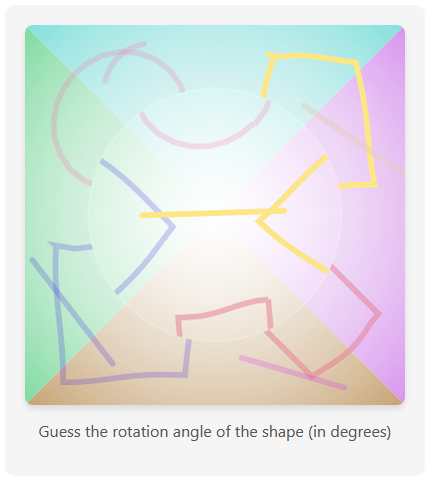

# rotaptcha-node



A modern, gamified CAPTCHA solution for Node.js — no distorted text, no annoyance, just fun interactive challenges that users actually enjoy.

## Features

- **Rotation-based puzzle** – identify the rotation angle of shapes in a circular viewport
- **Zero external dependencies** – uses only Canvas API for shape rendering
- **Framework-agnostic** – works seamlessly with Express, Fastify, Next.js API routes, Hono, Elysia, and any Node.js server
- **Simple UUID-based verification** – generate challenge, verify answer in one line
- **Blazing fast** – sub-millisecond verification, in-memory storage with LokiJS
- **Fully customizable** – adjust canvas size, rotation range, wobble effects, noise, and stroke width

## Installation

```bash
npm install rotaptcha-node
```

```bash
yarn add rotaptcha-node
```

```bash
pnpm add rotaptcha-node
```

```bash
bun add rotaptcha-node
```

## How It Works

rotaptcha generates a visual puzzle where:
1. **Four random shapes** (circles, squares, triangles, pentagons, hexagons) are drawn in quadrants
2. **The center circular area** shows the same shapes but rotated by a specific angle
3. **The user must identify** the rotation angle to solve the challenge

The rotation angle is stored server-side with a unique UUID, and verification happens by comparing the user's answer.

## Quick Start

### Backend Example (Express)

```ts
import express from 'express';
import rotaptcha from 'rotaptcha-node';

const app = express();
app.use(express.json());

// Your secret key for JWT encryption (keep this secure!)
const SECRET_KEY = 'your-secret-key-min-32-chars-long';

// Generate a CAPTCHA challenge
app.get('/captcha/create', async (req, res) => {
  const { image, token } = await rotaptcha.create({
    width: 400,
    height: 400,
    minValue: 20,
    maxValue: 90,
    step: 10,
    strokeWidth: 6,
    wobbleIntensity: 3,
    noise: true,
    noiseDensity: 5,
    expiryTime: 5 // 5 minutes
  }, SECRET_KEY);

  res.json({ 
    image: `data:image/png;base64,${image}`,
    token // Send token to frontend for verification
  });
});

// Verify the user's answer
app.post('/captcha/verify', async (req, res) => {
  const { token, answer } = req.body;

  const isValid = await rotaptcha.verify({ token, answer }, SECRET_KEY);

  if (!isValid) {
    return res.status(400).json({ error: 'Invalid CAPTCHA or expired' });
  }

  res.json({ message: 'Success! CAPTCHA verified.' });
});

app.listen(3000, () => console.log('Server running on port 3000'));
```

## API Reference

### `rotaptcha.create(options, secretKey)`

Generates a CAPTCHA image with rotated shapes in the center.

#### Parameters

| Parameter | Type | Default | Description |
|-----------|------|---------|-------------|
| `options` | `CreateProps` | - | Configuration object (see below) |
| `secretKey` | `string` | - | **Required.** Secret key for JWT encryption (minimum 32 characters) |

#### CreateProps Options

| Property | Type | Default | Description |
|----------|------|---------|-------------|
| `width` | `number` | `400` | Canvas width in pixels |
| `height` | `number` | `400` | Canvas height in pixels |
| `minValue` | `number` | `20` | Minimum rotation angle in degrees |
| `maxValue` | `number` | `90` | Maximum rotation angle in degrees |
| `step` | `number` | `10` | Step size for rotation (e.g., 10 means 20, 30, 40...) |
| `strokeWidth` | `number` | `6` | Line thickness for drawing shapes |
| `wobbleIntensity` | `number` | `3` | Intensity of wobbly/hand-drawn effect (0 = none, higher = more wobble) |
| `noise` | `boolean` | `true` | Add visual noise (dots, lines, speckles) for anti-bot protection |
| `noiseDensity` | `number` | `5` | Density of noise elements (higher = more noise) |
| `availableColors` | `string[]` | See below | Array of RGB color strings for shapes |
| `canvasBg` | `string` | `'rgb(230, 230, 230)'` | Canvas background color |
| `expiryTime` | `number` | `5` | Token expiry time in minutes |

**Default colors**: `['rgb(198, 231, 159)', 'rgb(230, 103, 171)', 'rgb(147, 128, 230)', 'rgb(255, 190, 152)', 'rgb(191, 230, 11)', 'rgb(88, 106, 175)', 'rgb(230, 122, 63)', 'rgb(223, 230, 73)']`

#### Returns

`Promise<{ image: string, token: string }>` 
- `image`: Base64-encoded PNG image
- `token`: Encrypted JWT token containing the challenge data

#### Implementation Details

The `create` method:
1. **Generates a random rotation angle** using `randomWithStep(minValue, maxValue, step)` - ensures the angle is a multiple of the step size (e.g., 20, 30, 40 if step=10)
2. **Creates a unique UUID** with `generateShortUuid()` - an 8-character alphanumeric identifier
3. **Creates an encrypted JWT token** containing:
   - `jti`: Unique identifier
   - `answer`: The correct rotation angle
   - `iat`: Issued at timestamp
   - `exp`: Expiry timestamp (current time + expiryTime minutes)
4. **Draws shapes** using HTML5 Canvas:
   - Four quadrants each get a random shape (circle, square, triangle, pentagon, or hexagon)
   - Shapes are drawn with seeded randomness to ensure consistency
   - A circular clipping mask is applied to the center
   - The center area is redrawn with the same shapes rotated by the target angle
5. **Applies effects**:
   - **Wobble**: Makes shapes appear hand-drawn with curved edges (intensity controlled by `wobbleIntensity`)
   - **Noise**: Adds dots, lines, crosses, and speckles for bot resistance (density controlled by `noiseDensity`)
6. **Returns an object** with `image` (Base64 PNG string) and `token` (encrypted JWT)

**Storage mechanism**: Uses JWT tokens encrypted with your secret key. No server-side storage required - all challenge data is embedded in the token itself.

### `rotaptcha.verify(options, secretKey)`

Verifies if the user's answer matches the stored rotation angle.

#### Parameters

| Parameter | Type | Required | Description |
|-----------|------|----------|-------------|
| `options` | `VerifyProps` | Yes | Verification object (see below) |
| `secretKey` | `string` | Yes | The same secret key used in `create()` |

#### VerifyProps Options

| Property | Type | Required | Description |
|----------|------|----------|-------------|
| `token` | `string` | Yes | The JWT token returned from `create()` |
| `answer` | `string` | Yes | User's rotation angle guess (as string) |

#### Returns

`Promise<boolean>` - `true` if answer is correct and token not expired, `false` otherwise

#### Implementation Details

The `verify` method:
1. **Decrypts the JWT token** using the secret key
2. **Checks token expiry** - returns false if expired
3. **Parses the answer** from string to integer using `parseInt()`
4. **Compares the answer** with the token's stored rotation value
5. **Returns true** if valid and not expired, **false** otherwise

**Important**: The verification is an exact match. The user must provide the precise rotation angle (e.g., "45" for 45 degrees).

**Security features**:
- **Automatic expiration**: Tokens expire after the configured time (default 5 minutes)
- **No server storage**: All data is encrypted in the token, preventing memory leaks
- **JWT-based**: Industry-standard token format with encryption
- **Tamper-proof**: Any modification to the token invalidates it

**Additional recommendations**:
- Use a strong secret key (minimum 32 characters)
- Implement rate limiting to prevent brute-force attacks
- Consider one-time use by tracking verified tokens in a short-lived cache

## Advanced Usage

### With Custom Styling

```ts
const SECRET_KEY = 'your-secret-key-min-32-chars-long';

const { image, token } = await rotaptcha.create({
  width: 600,
  height: 600,
  minValue: 0,
  maxValue: 180,
  step: 10,
  strokeWidth: 8,
  wobbleIntensity: 5,  // High wobble for hand-drawn aesthetic
  noise: true,
  noiseDensity: 8,     // Extra noise for bot protection
  availableColors: ['rgb(255, 0, 0)', 'rgb(0, 255, 0)', 'rgb(0, 0, 255)'],
  canvasBg: 'rgb(255, 255, 255)',
  expiryTime: 10       // 10 minutes expiry
}, SECRET_KEY);
```

### With One-Time Verification (Replay Attack Prevention)

```ts
import Keyv from 'keyv';

const usedTokens = new Keyv({ ttl: 600000 }); // 10 minutes cache
const SECRET_KEY = 'your-secret-key-min-32-chars-long';

app.post('/captcha/verify', async (req, res) => {
  const { token, answer } = req.body;
  
  // Check if token was already used
  if (await usedTokens.get(token)) {
    return res.status(400).json({ error: 'Token already used' });
  }
  
  const isValid = await rotaptcha.verify({ token, answer }, SECRET_KEY);
  
  if (isValid) {
    // Mark token as used to prevent replay attacks
    await usedTokens.set(token, true);
    res.json({ success: true });
  } else {
    res.status(400).json({ error: 'Invalid CAPTCHA or expired' });
  }
});
```

## Frontend Integration Example

```html
<!DOCTYPE html>
<html>
<body>
  
  <input type="number" id="rotation-input" placeholder="Enter rotation angle" />
  <button onclick="verify()">Verify</button>

  <script>
    let currentToken = null;

    // Load CAPTCHA on page load
    async function loadCaptcha() {
      const response = await fetch('/captcha/create');
      const data = await response.json();
      document.getElementById('captcha-image').src = data.image;
      currentToken = data.token;
    }

    // Verify user's answer
    async function verify() {
      const answer = document.getElementById('rotation-input').value;
      
      const response = await fetch('/captcha/verify', {
        method: 'POST',
        headers: { 'Content-Type': 'application/json' },
        body: JSON.stringify({ token: currentToken, answer })
      });

      const result = await response.json();
      alert(result.message || result.error);
      
      // Load new CAPTCHA after verification attempt
      if (result.success) {
        loadCaptcha();
      }
    }

    loadCaptcha();
  </script>
</body>
</html>
```

## Architecture

### Shape Generation
- Five shape types: circles, squares, triangles, pentagons, hexagons
- Seeded random function ensures consistency between initial draw and rotated draw
- Shapes are 85% of quadrant size by default for visual balance

### Rotation Mechanism
1. Draw shapes in four quadrants
2. Apply circular clipping mask to center (radius = canvas width / 3)
3. Clear the clipped area
4. Apply rotation transformation
5. Redraw the same shapes (using same seed)
6. Remove clipping mask

### Effects
- **Wobble**: Replaces straight lines with quadratic curves with random control points (intensity controlled by `wobbleIntensity` parameter, default: 3)
- **Noise**: Adds noise elements (dots, lines, crosses) and speckles with 40% opacity (density controlled by `noiseDensity` parameter, default: 5)

## Why rotaptcha?

Traditional CAPTCHAs frustrate users and hurt conversion rates. rotaptcha turns security into a delightful micro-interaction that's:
- **Accessible** – easier to solve than distorted text
- **Fast** – typical solve time under 5 seconds
- **Effective** – visual puzzles are harder for bots to automate

Start protecting your users today — no more "I can't read this squiggly text" support tickets.

## License

MIT

Made with care for modern web applications.
